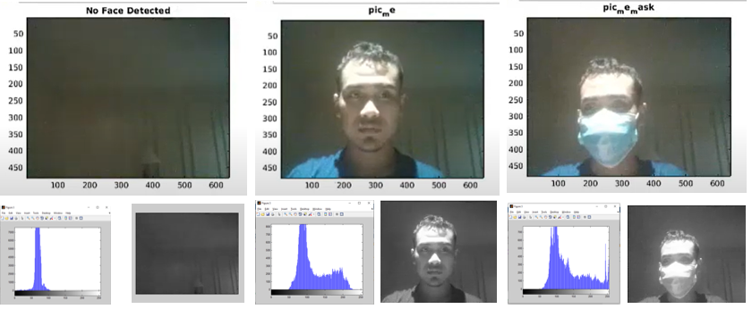

# Facemask Detection Project
Purpose: Facemask Detection for preventing covid-19 case

## 1. Data Collection
Collect 150 picture as the dataset by capturing picture using webcam

```
clc
clear all
close all
warning off;
cao=webcam;
faceDetector=vision.CascadeObjectDetector;
c=150;
temp=0;
while true
    e=cao.snapshot;
    bboxes =step(faceDetector,e);
    if(sum(sum(bboxes))~=0)
    if(temp>=c)
        break;
    else
    es=imcrop(e,bboxes(1,:));
    es=imresize(es,[227 227]);
    filename=strcat(num2str(temp),'.bmp');
    imwrite(es,filename);
    temp=temp+1;
    imshow(es);
    drawnow;
    end
    else
        imshow(e);
        drawnow;
    end
end
```
Noted: make sure that the data is captured perfectly


## 2. Data Training
In this step, the system will learn how the data goes. You need to consider also the learning rate, batch size, etc.

```
clc;close;clear
c=webcam;
load myNet1;
faceDetector=vision.CascadeObjectDetector;
while true
    e=c.snapshot;
    bboxes =step(faceDetector,e);
    if(sum(sum(bboxes))~=0)
     es=imcrop(e,bboxes(1,:));
    es=imresize(es,[227 227]);
    label=classify(myNet1,es);
    image(e);
    title(char(label));
    drawnow;
    else
        image(e);
        title('No Face Detected');
    end
end
```


## 3. Data Testing

Now, we can see how the system is able to work. 
It will inform the face and the facemask

```
clc;close;clear
c=webcam;
load myNet1;
faceDetector=vision.CascadeObjectDetector;
while true
    e=c.snapshot;
    bboxes =step(faceDetector,e);
    if(sum(sum(bboxes))~=0)
     es=imcrop(e,bboxes(1,:));
    es=imresize(es,[227 227]);
    label=classify(myNet1,es);
    image(e);
    title(char(label));
    drawnow;
    else
        image(e);
        title('No Face Detected');
    end
end
```
The reult is quite good



